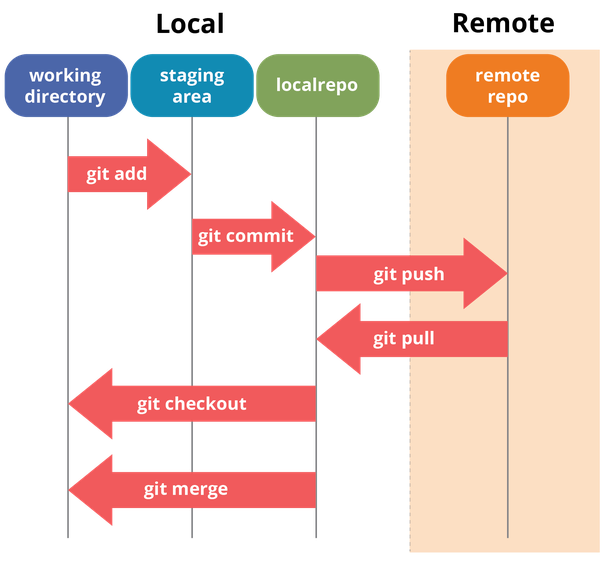

# ChasVCS
- Version control system I am building. 
- Basing it off Git staging

## Features I am building first (local repo)
- Initialization: Initialize an empty repository.
- Add: Add files to the repository.
- Commit: Save a snapshot of changes made to files.
- Checkout: Used to:
    - 'checkout' a specific commit on a specific branch using commit_hash 
- Branch: Create and manage branches.
- Merge: Merge changes from one branch into another.
- Diff: Show differences between versions of files.

## Features I will build once I have completed the above (remote repo - probably use)
- Push to remote repo 
- Pull from remote repo

## How will it work?
- The code is written in C, and when compiled produces a `chas` executable
- This executable will need to be put in the directory we are using the chas commands in.
- Example usage: `./chas init`,`./chas add file.txt`

## TODO
- Need ability to track/commit directories. Should be trivial, just need to store the path.